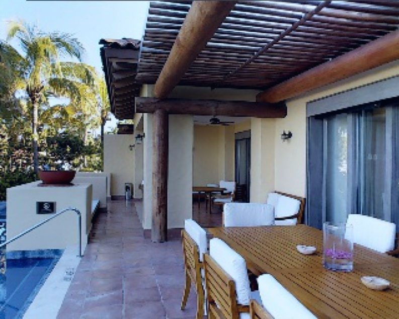
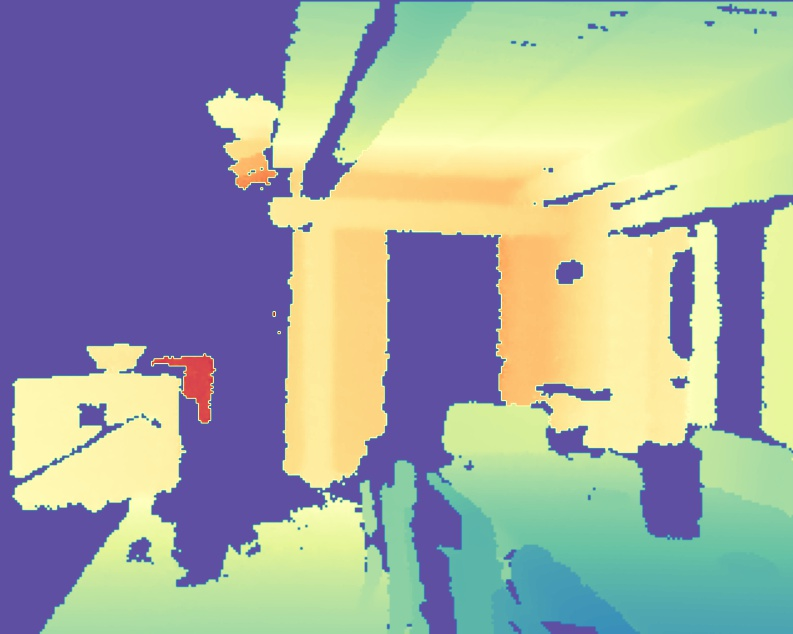
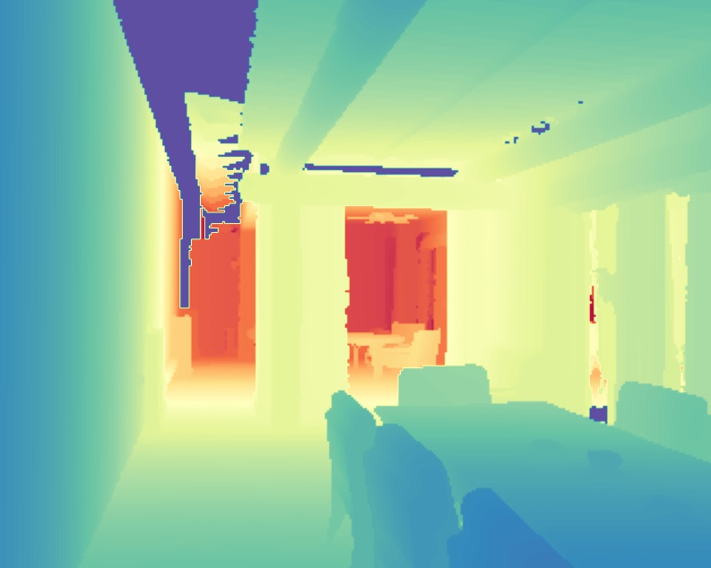
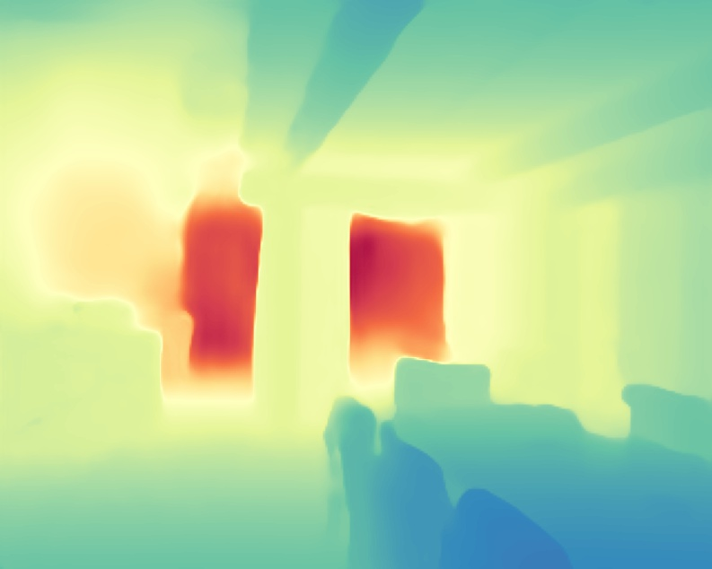

# Decoder Modulation for Indoor Depth Completion

<p align="center">
    
    
    
    
 </p>

> **Decoder Modulation for Indoor Depth Completion**<br>
> [Dmitry Senushkin](https://github.com/senush),
> [Ilia Belikov](https://github.com/ferluht),
> [Anton Konushin](https://scholar.google.com/citations?user=ZT_k-wMAAAAJ)
> <br>
> Samsung AI Center Moscow <br>
> https://arxiv.org/abs/20??.?????

> **Abstract**: *Accurate depth map estimation is an essential step in scene spatial mapping for AR applications and 3D modeling. Current depth sensors provide time-synchronized depth and color images in real-time, but have limited range and suffer from missing and erroneous depth values on transparent or glossy surfaces. We investigate the task of depth completion that aims at improving the accuracy of depth measurements and recovering the missing depth values using additional information from corresponding color images. Surprisingly, we find that a simple baseline model based on modern encoder-decoder architecture for semantic segmentation achieves state-of-the-art accuracy on standard depth completion benchmarks. Then, we show that the accuracy can be further improved by taking into account a mask of missing depth values. The main contributions of our work are two-fold. First, we propose a modified decoder architecture, where features from raw depth and color are modulated by features from the mask via Spatially-Adaptive Denormalization (SPADE). Second, we introduce a new loss function for depth estimation based on direct comparison of log depth prediction with ground truth values. The resulting model outperforms current state-of-the-art by a large margin on the challenging Matterport3D dataset.*

## Installation
This implementation is based on Python 3+ and Pytorch 1.4+. We provide two ways of setting up an environment. If you are using `Anaconda`, the following code performs necessary installation:
```.bash
conda env create -f environment.yaml
conda activate depth-completion
python setup.py install
```
The same procedure can be done with `pip`:
```.bash
pip3 install -r requirements.txt
python setup.py install
```

## Training
We provide a code for training on [Matterport3D](https://github.com/patrickwu2/Depth-Completion/blob/master/doc/data.md). Download Matterpord3D dataset and reorder your root folder as follows:
```bash
ROOT/
  ├── data/
  └── splits/
        ├── train.txt
        ├── val.txt
        └── test.txt 
```
and `data` directory is should be configured in [this order](https://github.com/patrickwu2/Depth-Completion/blob/master/doc/data.md). Be sure that ROOT path in [matterport.py](https://github.sec.samsung.net/d-senushkin/saic_depth_completion_public/blob/master/saic_depth_completion/data/datasets/matterport.py) is valid. 
Now you can start training with the following command:
```.bash
# for LRN decoder with efficientnet-b4 backbone
python train_matterport.py --default_cfg='LRN' --config_file='../configs/LRN_efficientnet-b4_lena.yaml' --postfix='example_lrn' 
# for DM-LRN decoder with efficientnet-b4 backbone
python train_matterport.py --default_cfg='DM-LRN' --config_file='../configs/DM-LRN_efficientnet-b4_pepper.yaml' --postfix='example_dm_lrn' 
```

## Evaluation
We provide scripts for evaluation on Matterport3D. If you need to perform test on NYUv2, see directly into a code since it may be changed in the future. Following instructions performs evaluation on Matterport3D test set:
```.bash
# for LRN decoder with efficientnet-b4 backbone
python test_net.py --default_cfg='LRN' --config_file='../configs/LRN_efficientnet-b4_lena.yaml' --weights=<path to lrn_b4.pth>
# for DM-LRN decoder with efficientnet-b4 backbone
python test_net.py --default_cfg='DM-LRN' --config_file='../configs/DM-LRN_efficientnet-b4_pepper.yaml' --weights=<path to dm-lrn_b4.pth>
# if you need to visualize the results just add --save_dir argument
python test_net.py --default_cfg='DM-LRN' --config_file='../configs/DM-LRN_efficientnet-b4_pepper.yaml' --weights=<path to dm-lrn_b4.pth> --save_dir=<path to existing folder>
```

## Model ZOO
This repository includes all models mentioned in original paper. 

| Backbone | Decoder<br>type   | Encoder<br>input | Training loss |      Link        |  Config |
|----------|-----------|:-----:|:-------------:|:----------------:|:----------:|
| efficientnet-b0 | LRN | RGBD | LogDepthL1loss | [lrn_b0.pth][lrn_b0] | LRN_efficientnet-b0_suzy.yaml |
| efficientnet-b1 | LRN | RGBD | LogDepthL1loss | [lrn_b1.pth][lrn_b1] | LRN_efficientnet-b1_anabel.yaml |
| efficientnet-b2 | LRN | RGBD | LogDepthL1loss | [lrn_b2.pth][lrn_b2] | LRN_efficientnet-b2_irina.yaml |
| efficientnet-b3 | LRN | RGBD | LogDepthL1loss | [lrn_b3.pth][lrn_b3] | LRN_efficientnet-b3_sara.yaml |
| efficientnet-b4 | LRN | RGBD | LogDepthL1loss | [lrn_b4.pth][lrn_b4] | LRN_efficientnet-b4_lena.yaml |
| efficientnet-b4 | LRN | RGBD | BerHu | [lrn_b4_berhu.pth][lrn_b4_berhu] | LRN_efficientnet-b4_helga.yaml |
| efficientnet-b4 | LRN | RGBD+M | LogDepthL1loss | [lrn_b4_mask.pth][lrn_b4_mask] | LRN_efficientnet-b4_simona.yaml |
| efficientnet-b0 | DM-LRN | RGBD | LogDepthL1Loss | [dm-lrn_b0.pth][dm-lrn_b0] | DM_LRN_efficientnet-b0_camila.yaml |
| efficientnet-b1 | DM-LRN | RGBD | LogDepthL1Loss | [dm-lrn_b1.pth][dm-lrn_b1] | DM_LRN_efficientnet-b1_pamela.yaml |
| efficientnet-b2 | DM-LRN | RGBD | LogDepthL1Loss | [dm-lrn_b2.pth][dm-lrn_b2] | DM_LRN_efficientnet-b2_rosaline.yaml |
| efficientnet-b3 | DM-LRN | RGBD | LogDepthL1Loss | [dm-lrn_b3.pth][dm-lrn_b3] | DM_LRN_efficientnet-b3_jenifer.yaml |
| efficientnet-b4 | DM-LRN | RGBD | LogDepthL1Loss | [dm-lrn_b4.pth][dm-lrn_b4] | DM_LRN_efficientnet-b4_pepper.yaml |
| efficientnet-b4 | DM-LRN | RGBD | BerHu | [dm-lrn_b4_berhu.pth][dm-lrn_b4_berhu] | DM_LRN_efficientnet-b4_amelia.yaml |

[lrn_b0]: 
[lrn_b1]: 
[lrn_b2]: 
[lrn_b3]: 
[lrn_b4]: 
[lrn_b4_berhu]: 
[lrn_b4_mask]: 

[dm-lrn_b0]: 
[dm-lrn_b1]: 
[dm-lrn_b2]: 
[dm-lrn_b3]: 
[dm-lrn_b4]: 
[dm-lrn_b4_berhu]: 

## License
The code is released under the MPL 2.0 License. MPL is a copyleft license that is easy to comply with. You must make the source code for any of your changes available under MPL, but you can combine the MPL software with proprietary code, as long as you keep the MPL code in separate files.

## Citation
If you find this work is useful for your research, please cite our paper:
```
@article{dmidc2020,
  title={Decoder Modulation for Indoor Depth Completion},
  author={Dmitry Senushkin, Ilia Belikov, Anton Konushin},
  journal={arXiv preprint arXiv:20??.????},
  year={2020}
}
```
